# Dotnet Tools Playground

Um repositório para aprender sobre as ferramentas de build e teste para ecossistema dotnet.  
Este repositório contém duas aplicações idênticas, uma com modelo de projeto novo suportado a partir do Visual Studio 2017 e outro com o modelo suportado até o Visual Studio 2015.

# Sumário

  * [Sobre o projeto BankAccountCli](#sobre-o-projeto-bankaccountcli)
  * [Pré-requisitos](#pr--requisitos)
  * [Anatomia projeto dotnet](#anatomia-projeto-dotnet)
  * [Baixando dependencias com NuGet](#baixando-dependencias-com-nuget)
  * [Compilando com o MSBuild](#compilando-com-o-msbuild)
    + [Configurando MSBuild](#configurando-msbuild)
    + [Compilando projetos da solução](#compilando-projetos-da-solu--o)
    + [Debug x Release](#debug-x-release)
    + [Outros usos do MSBuild](#outros-usos-do-msbuild)
  * [Testando com vstest](#testando-com-vstest)
  * [Cobertura de testes com OpenCover](#cobertura-de-testes-com-opencover)
  * [Melhorando o output do OpenCover com o ReportGenerator](#melhorando-o-output-do-opencover-com-o-reportgenerator)
- [Utilizando dotnet CLI](#utilizando-dotnet-cli)
  * [Instalando dependências com dotnet CLI](#instalando-depend-ncias-com-dotnet-cli)
  * [Compilando com dotnet CLI](#compilando-com-dotnet-cli)
  * [Testando o projeto com dotnet CLI](#testando-o-projeto-com-dotnet-cli)
  * [Executando o projeto com dotnet CLI](#executando-o-projeto-com-dotnet-cli)
  * [Publicando o projeto com dotnet CLI](#publicando-o-projeto-com-dotnet-cli)
- [Contribuindo](#contribuindo)

## Sobre o projeto BankAccountCli

Este é um projeto de exemplo que simula operações de crédito e débito em uma conta corrente. Depois de [compilado](#compilando-com-o-msbuild) você pode executar o projeto com a linha de comando abaixo.

``` powershell
BankAccountCli.exe --account nome_da_conta --balance 100 --credit --ammount 25.10
# Current balance is $125,1
```

## Pré-requisitos

- S.O. Windows 8 ou maior.
- [Build Tools for Visual Studio 2017](https://www.visualstudio.com/pt-br/thank-you-downloading-visual-studio/?sku=BuildTools&rel=15)
- [Visual Studio Test Agent 2017](https://www.visualstudio.com/pt-br/thank-you-downloading-visual-studio/?sku=TestAgent&rel=15)
    - Apenas instalação de arquivos não necessita conectar a um controller.
- [Dotnet Framework 4.6.2 Developer Pack](https://www.microsoft.com/net/download/windows)
- [Dotnet Core SDK](https://www.microsoft.com/net/download/windows)
- [Nuget CLI](https://www.nuget.org/downloads)
- [OpenCover](https://github.com/OpenCover/opencover/releases)
- [ReportGenerator](https://github.com/danielpalme/ReportGenerator/releases)

## Anatomia projeto dotnet

Um repositório dotnet é composto de uma solução e um ou mais projetos.

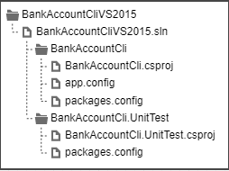

* Solução - Arquivo com extensão .sln mantém relação de projetos que fazem parte da solução.

* Projetos - Arquivos com extensão .*proj geralmente .csproj (C#) ou .vbproj(Visual Basic). 
Os arquivos de projeto contém informações como framework alvo de compilação, depêndencias e plataforma alvo (x86, x64).
Uma solução geralmente é divida em projetos utilizando conceito de camadas, como core, acesso a dados e apresentação. Testes também são colocados em projetos a parte.

* Arquivos de configuração - Arquivos com extensão .config, são arquivos de configurações clássicos de aplicações dotnet, seguem formato xml e contém parametrizações das aplicações como connections strings.

* Dependencia de pacotes - Os pacotes nuget (gerenciador de pacotes dotnet) necessários para compilar o projeto são declarados no arquivo packages.config.

## Baixando dependencias com NuGet

NuGet é o gerenciador de pacotes para bibliotecas dotnet. A maioria dos projetos dependem de pacotes NuGet para serem compilados, por isso devemos restaurar essas dependencias antes de compilar o código fonte.

O comando `nuget restore` pode receber como parâmetro o arquivo .sln ou .csproj. Se receber um .sln ele instala as dependencias listadas nos packages.config de cada projeto. Se receber um .csproj, baixa somente as dependencias desse projeto listadas no packages.config.

Após fazer do download do nuget.exe execute o seguinte comando:
``` powershell
nuget.exe restore .\src\BankAccountCliVS2015\BankAccountCliVS2015.sln
```
Os pacotes serão baixados na pasta packages no diretório do arquivo .sln.  
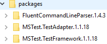

## Compilando com o MSBuild

Para compilar projetos dotnet utilizamos o auxiliar de compilação e executor de tarefas **MSBuild**.

O utilitário de linha de comando *msbuild.exe* recebe como parâmetro um arquivo de solução(.sln) ou projeto (.*proj) e gera um ou mais *assemblies* dotnet em formato **.dll** ou **.exe**.

### Configurando MSBuild

Para localizar o executavel do msbuild você deve executar o seguinte comando:

``` powershell
reg.exe query "HKLM\SOFTWARE\Microsoft\MSBuild\ToolsVersions\4.0" /v MSBuildToolsPath
```

Você pode adicionar esse diretório ao PATH com o comando abaixo para facilitar a utilização os comandos do msbuild. Deve executado em um terminal powershell como administrador.

``` powershell
[Environment]::SetEnvironmentVariable("PATH", $env:PATH + "<saída do comando anterior>", [System.EnvironmentVariableTarget]::User)
```

### Compilando projetos da solução

Vamos utilizar o MSBuild para compilar a solução BankAccounCliVS2015 que contém o modelo de csproj antigo encontrado na maioria dos projetos **dotnet framework**.

Execute o seguinte comando para compilar a solução que contém dois projetos:

``` powershell
msbuild .\src\BankAccountCliVS2015\BankAccountCliVS2015.sln
```

A saída deve ser algo como abaixo:
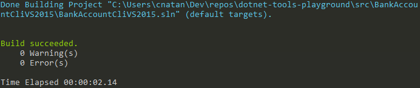

Por padrão o projeto é compilado em modo Debug, o diretório padrão de saída é `bin\Debug` na pasta do projeto (onde é localizado o .csproj).  
Diretório de saída:  
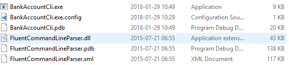

### Debug x Release

O MSBuild por padrão compila os projetos em modo Debug, oque quer dizer que gera artefatos preparados para debug através da IDE, além de não estarem otimizados para uso em produção.  
Já em modo Release o compilador gera artefatos otimizados para produção.

Execute o seguinte comando para compilar em modo Release:
``` powershell
msbuild .\src\BankAccountCliVS2015\BankAccountCliVS2015.sln /p:Configuration=Release
```

O diretório padrão de saída é `bin\Release`.

### Outros usos do MSBuild

Além de ser utilizado para compilar os projetos dotnet o MSBuild também é um automatizador de tarefas que podem executar rotinas pré e pós build, adicionando *Tasks* no xml do projeto (.csproj).

Alguns exemplos de tasks são:
- Gerar artefato no formato de deploy para IIS.
- Empacotar aplicação com chocolatey
- Validação de scheme de um xml.

Vamos criar uma task simples para entender como funciona, edite o arquivo BankAccountCli.csproj e adicione as tasks ao fim do arquivo:

```xml
...
  <Target Name="BeforeBuild">
    <Exec Command="powershell -c Get-Date > $(OutputPath)\build_duration.txt"/>
  </Target>
  <Target Name="AfterBuild">
    <Exec Command="powershell -c Get-Date >> $(OutputPath)\build_duration.txt"/>
  </Target>
</Project>
```

Essas duas tasks irão escrever no arquivo build_duration.txt no diretório de saída a data/hora de ínicio e fim do build.
Execute o build novamente e veja o resultado.

## Testando com vstest

O vstest é um executor de testes para projetos dotnet utilizado pelo Visual Studio. Ele serve tanto para executar projetos com xunit, mstest e outros, abstraindo a interface com cada ferramenta.

O vstest.console.exe fica localizado na pasta de instalação do visual studio em `C:\Program Files (x86)\Microsoft Visual Studio\2017\Enterprise\Common7\IDE\CommonExtensions\Microsoft\TestWindow`. 

Para executar os testes, o projeto de testes deve ser primeiro compilado, o que já foi executado na etapa anterior, pois quando passamos uma solução como parâmetro para o MSBuild todos os projetos são compilados.  
Em seguida devemos invocar o vstest.console.exe passando como parâmetro a dll de output do projeto de teste.

Execute o seguinte comando powershell para rodar os testes:

``` powershell
& 'C:\Program Files (x86)\Microsoft Visual Studio\2017\Enterprise\Common7\IDE\CommonExtensions\Microsoft\TestWindow\vstest.console.exe' .\src\BankAccountCliVS2015\BankAccountCli.UnitTest\bin\Debug\BankAccountCli.UnitTest.dll
```

Saída do comando:  
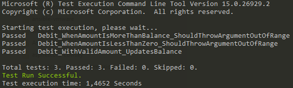

## Cobertura de testes com OpenCover

O OpenCover é uma ferramenta de cobertura de testes open source para o ambiente dotnet. 

O `openconver.console.exe` fica localizado na pasta `C:\Users\<SEU-USUARIO>\AppData\Local\Apps\OpenCover\OpenCover.Console.exe` , mas para a sua facilidade você pode incluí-lo em seu PATH.

O output do OpenCover é um arquivo `.xml` pouco legível que contém os resultados do coverage, mas que podemos parsear com a ferramenta ReportGenerator, que será abordada mais para frente.

Para executar o OpenCover é necessário que você indique qual é o comando que executa os testes, incluindo os argumentos necessários, utilizando os parâmetros `-target:<comando de testes>` e `-targetargs:<parâmetros do comando de testes>`. Como utilizamos o `vstest`, o `-target:` é o path dele, e o `-targetargs:` são os argumentos que ele consume.

O OpenCover acaba fazendo a análise de coverage da própria DLL do projeto de testes, o que não faz muito sentido, por isso é recomendado utlizarmos um filtro para ignorar as classes de testes e considerar apenas o código fonte. Este filtro pode ser passado como o parâmetro `-filter:`, aonde podemos seguir a sintaxe do filtro para incluir todo o projeto e excluir qualquer assembly terminado em `UnitTest`, da seguinte forma : `-filter:"+[*]* -[*UnitTest]*"`. 

Um outro parâmetro interessante é o `-skipautoprops`, que faz com que o OpenCover não faça a cobertura de propriedades auto implementadas, como getters e setters.

Podemos especificar o caminho e nome do `output.xml` com o parâmetro `-output:`. 

Por último, também é preciso especificar o parâmetro `-register:`, que diz se o binário a ser testado é de 32 (`-register:path32`) ou 64 bits(`-register:path64`).

Execute o seguinte comando powershell para gerar o report de coverage:
```powershell
 C:\Users\<SEU-USUARIO>\AppData\Local\Apps\OpenCover\OpenCover.Console.exe -target:"C:\Program Files (x86)\Microsoft Visual Studio\2017\Enterprise\Common7\IDE\CommonExtensions\Microsoft\TestWindow\vstest.console.exe" -targetargs:"src\BankAccountCliVS2015\BankAccountCli.UnitTest\bin\Debug\BankAccountCli.UnitTest.dll" -register:path32 -skipautoprops -filter:"+[*]* -[*UnitTest]*"
```

A saída do comando deve ser como abaixo:

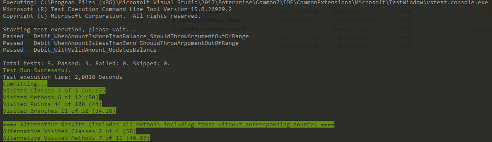

E o arquivo `output.xml` será gerado na pasta em que o comando foi gerado ou no local especificado pelo parametro `-output:`.

## Melhorando o output do OpenCover com o ReportGenerator

Como a saída do OpenCover é um xml com baixíssima legibilidade, é comum utilizarmos a ferramenta ReportGenerator para ler este `.xml` e gerar um HTML com melhor visualização.

Uma vez baixado o `ReportGenerator.exe`, podemos indicar o caminho do XML fonte com o parâmetro `-reports:`, e do diretório de saída do HTML e das imagens com o `-targetdir:`.

Também podemos especificar quais tipos de report queremos com o `-reporttypes:` , que incluem em diversas opções como gerar em `HTML`, `Latex` ou outros. O que costumamos utilizar é o report `Html`, que é a opção padrão e gera um HTML com um bom overview e links para os reports mais detalhados de cada classe.

Execute o seguinte comando powershell para gerar o HTML com o coverage:

```
 C:\Users\<SEU-USUARIO>\tools\ReportGenerator_3.1.2.0\ReportGenerator.exe -reports:.\output.xml -targetdir:Report -reporttypes:Html
```

Dentro da pasta `Report` você encontrará um `index.html` com o coverage com uma boa visualização.


# Utilizando dotnet CLI

Com a criação do dotnet core que traz suporte a desenvolvimento multi-plataforma, a forte dependencia com a IDE se tornou um problema, então a Microsoft criou uma nova ferramenta de linha de comando para facilitar os processos de desenvolvimento como build, test, restore e etc.
Porém esse utilitário só é compátivel com o novo modelo de arquivo de projeto (csproj), que é o padrão para dotnet core e que também pode ser adotado em projetos dotnet framework (console app, dll, unit tests). O arquivo de projeto até então era manipulado pela IDE oque o tornava muito extenso e pouco legivel, a nova versão é muito mais enxuta e foi pensada para facilitar a edição manual em um editor de texto simples.  

O novo modelo de csproj é suportado apenas a partir do Visual Studio 2017.
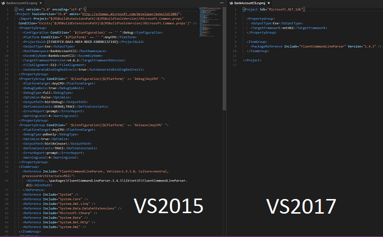

Neste repositório os projetos da solução BankAccountCliVS2017 são compativéis com a nova CLI.

## Instalando dependências com dotnet CLI

Para instalar as dependências NuGet com a nova CLI basta apenas estar no diretório da solução ou projeto e executar o seguinte comando:
```
PS src\BankAccountCliVS2017\> dotnet restore
```

Você pode também passar o caminho para o diretório da solução ou projeto:
```
dotnet restore .\src\BankAccountCliVS2017\
```
Ou o caminho do arquivo alvo:
```
dotnet restore .\src\BankAccountCliVS2017\BankAccountCliVS2017.sln
```

O output do comando deve ser como baixo:

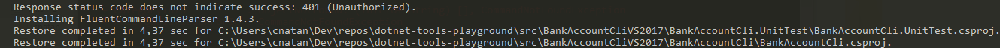


## Compilando com dotnet CLI

Para buildar o projeto com a nova CLI  basta você executar o comando:

```
dotnet build
```

Assim como no comando `dotnet restore`, o `dotnet build` pode ser chamado dentro da **pasta do diretório ou solução**, apontando para **a pasta** ou para os **arquivos `.sln`** ou **`.csproj`**.

A saída do comando deve ser como abaixo:
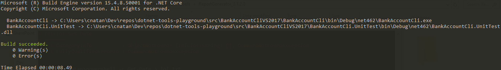

O `dotnet build` executa um `dotnet restore` por default, ou seja, mesmo que você esqueça de dar um restore previamente a nova CLI cuida disso para você.

O comando de `dotnet build` também pode receber alguns parâmetros, como por exemplo o `-r\--runtime` que permite você escolher para qual target você quer buildar, como por ex: ` win-x64`, `win-x86`, `linux-x64` ou `osx-x64` e outros que você pode consultar [aqui](https://docs.microsoft.com/en-us/dotnet/core/rid-catalog).

Também é possível escolher para qual versão do framework dotnet core ou dotnet framework você quer compilar o projeto, porém deve-se lembrar que essas versões tem de estar especificadas no seu arquivo de `.csproj`. O comando que permite escolher a framework é o `-f\--framework`, que você deve preencher conforme a versão do framework desejada.

Com a dotnet CLI também é possível configurar se queremos um build de `Debug` ou de `Release`, que podemos específicar com o parametro `-c\--configuration`.

Para saber mais sobre outros parâmetros disponíveis você pode consultar a excelente documnetação [aqui](https://docs.microsoft.com/en-us/dotnet/core/tools/dotnet-build?tabs=netcore2x).


## Testando o projeto com dotnet CLI

A nova CLI também possuí um comando para facilitar testes, o `dotnet test`. Com ele basta você passar o caminho do `.csproj` do projeto de testes que ele mesmo compila e executa os testes de uma única vez para você. 

Execute o comando abaixo para testar com a dotnetCLI:

```
dotnet test .\BankAccountCli.UnitTest\BankAccountCli.UnitTest.csproj
```

O output do comando vai ser algo como abaixo:
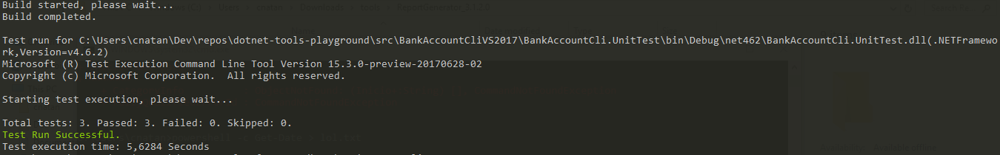


## Executando o projeto com dotnet CLI

Uma outra facilidade que veio com a nova dotnet CLI é o comando `dotnet run`, que já faz o processo de `restore`, `build` e em seguida executa o seu projeto. 

Ele também aceita os parâmetros como `-f\--framework` para especificar qual versão do framework você quer executar, mantedo a mesma restrição do `dotnet build`.

Assim como o parâmetro `-c\--configuration`, que também pode ser configurado com os valores de `Debug` ou `Release`.

O comando de `run` roda a partir do seu arquivo de projetos, e não da DLL compilada, o que serve para facilitar a vida do desenvolvedor porém **não deve ser utilizado para executar código de produção**. 

Para distruibuir código de produção você deve utilizar o comando `dotnet publish` que compila seu código e gera os artefatos junto das dependências, com todas as otimizações de produção.

O output do comando vai ser algo como abaixo:
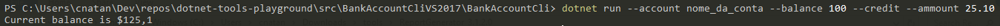

## Publicando o projeto com dotnet CLI

O comando de publish é utilizado para gerar uma versão final dos artefatos a serem implantados, por isso gera de maneira isolada um diretório auto-contido com todas as dependências para executar a aplicação.

Alguns dos possíveis parâmetros são os mesmos dos comandos anteriores como `-c\--configuration`,`-f\--framework`.

Para determinar o diretório de saída utilize o parâmetro `-o\--output`.

Para projetos **dotnet core** você pode publicar um executável que contém o runtime do netcore através do parâmetro `--self-contained`, assim dispensando que o runtime esteja instalado na maquina de destino.

Para publicar nosso projeto de exemplo você pode utilizar o seguinte comando:

```
PS src\BankAccountCliVS2017\BankAccountCli> dotnet publish -c release -o app
```
O output do comando vai ser algo como abaixo:
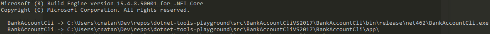

# Contribuindo

Se você encontrou algum erro ou possui uma sugetão de melhoria contribua através de issues ou abra um pull request.